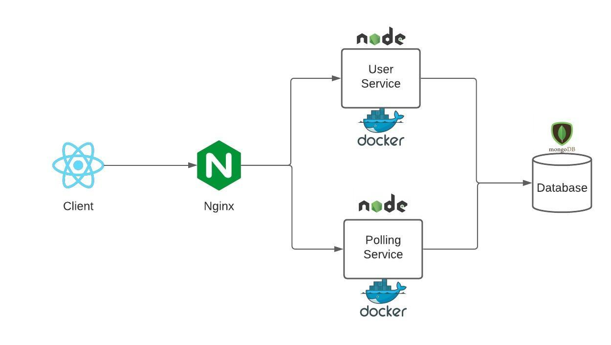

# Polling Microservice App

This repository comprises the server side code for a Microservice based Polling App. The app consists of a polling-service for making polls, and a user service for authenticating the users.
Both the user-service and the polling-service are running on Docker containers. An Nginx based API Gateway is used to redirect the client requests to the appropriate service.

## Tech Stack

- NodeJS
- Express
- MongoDB
- Nginx
- Docker

## Getting Started

Clone the repository to your local machine.

#### `cd microservice-app-server`

Install the dependecies

#### `npm install`

Run the following command to start the services.

#### `docker-compose up`

#### For the client side code [click here](https://github.com/neilchauhan2/microservice-app-client "click here").
